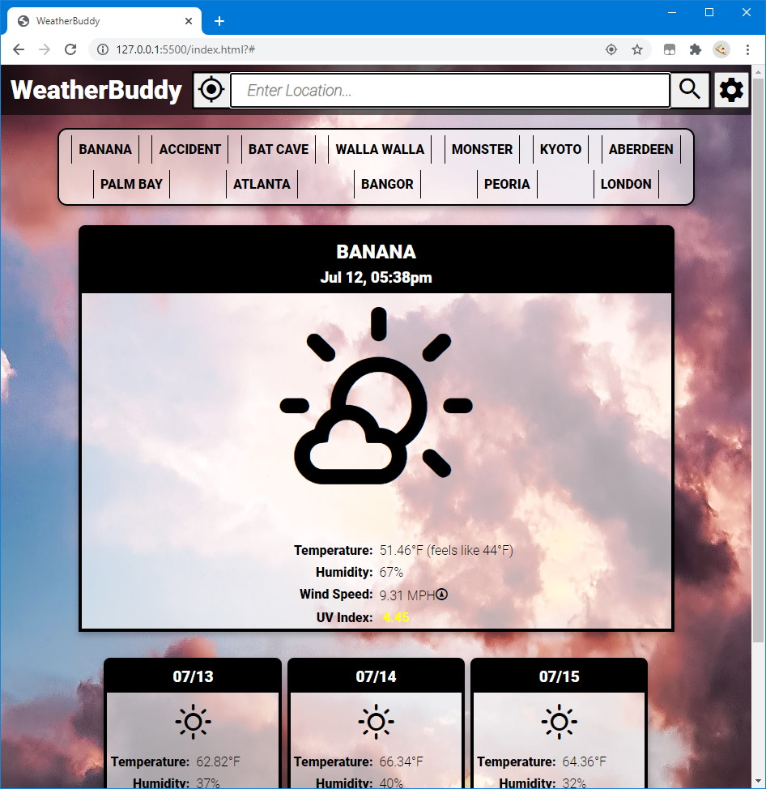

# [WeatherBuddy](https://gminteer.github.io/weatherbuddy/)

A simple dashboard for viewing current and upcoming weather conditions at a glance. Run it live [here](https://gminteer.github.io/weatherbuddy/) (bring your own OpenWeatherMap API key)!

## Features

- Search by location name, or use your current location.
- Keeps track of your last 16 searched locations for easy repeated searches.
